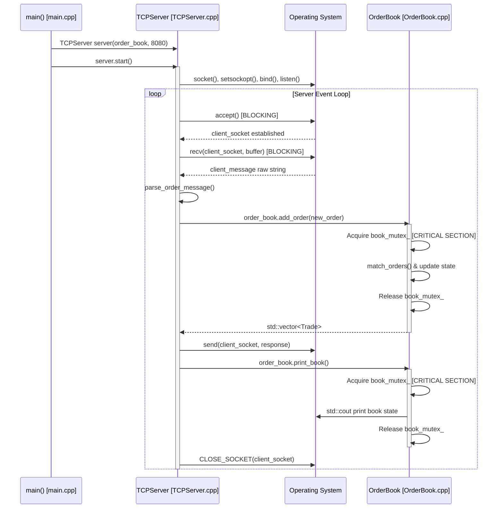
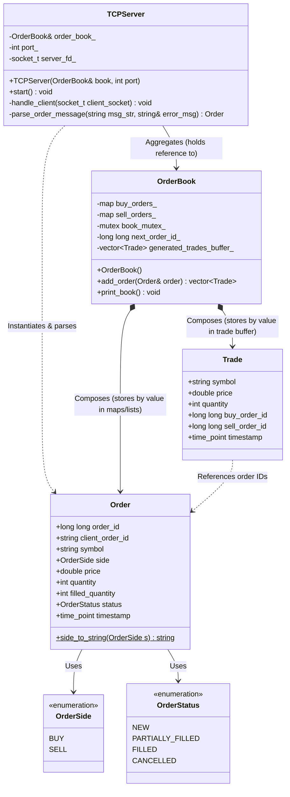

# HFT Simulator: Comprehensive Architectural Deep-Dive

This document provides a highly technical, end-to-end architectural deep-dive of the current High-Frequency Trading (HFT) simulator codebase.

---

## 1. Control Flow (Execution Lifecycles)

The execution path of the HFT simulator is completely synchronous and runs entirely on a single main execution thread. Below is the step-by-step trace of the control flow lifecycle:



### Detailed Trace:

1. **Initialization (`src/main.cpp`):**
   - The application begins execution in `main()`.
   - It instantiates `OrderBook order_book;` on the stack (assigning `next_order_id_` to `1` in its constructor).
   - It instantiates `TCPServer server(order_book, 8080);` on the stack, which initializes Winsock on Windows platforms.
   - It calls `server.start()`.

2. **Network Setup & Listen Loop (`src/TCPServer.cpp`):**
   - Inside `TCPServer::start()`, the main thread:
     - Creates the listening socket: `server_fd_ = socket(...)`.
     - Configures socket options: `setsockopt(..., SO_REUSEADDR, ...)`.
     - Binds the socket to `INADDR_ANY` on port `8080`.
     - Calls `listen(server_fd_, 3)` with a backlog of 3 pending connections.
     - Enters the infinite loop `while (true)`.

3. **Client Connection Acceptance:**
   - The main thread blocks at `accept(server_fd_, ...)` until a client initiates a TCP handshake.
   - When a connection is established, `accept` returns a valid client socket descriptor (`client_socket`).
   - The thread execution resumes and immediately calls `handle_client(client_socket)`.

4. **Socket Reading & Parsing:**
   - Inside `handle_client()`, the thread blocks on `recv()` (Windows) or `read()` (POSIX) attempting to read up to `1023` bytes into the stack array `char buffer[1024]`.
   - Upon receiving bytes, the buffer is null-terminated and trimmed of trailing `\r\n` characters.
   - The thread calls `parse_order_message(client_message, error_msg)`.
     - The message is tokenized using a helper function that splits the string by comma (`,`).
     - Validation occurs for length (must be 5 tokens), order side (must match `"BUY"` or `"SELL"`), and numeric conversion (`std::stod` for price, `std::stoi` for quantity).
     - If valid, an `Order` struct is instantiated with status `NEW` and default ID `0`.

5. **Matching Engine Execution:**
   - The thread calls `order_book_.add_order(new_order)`.
   - **Control Transition:** Control transitions from the networking layer to the matching engine.
   - The thread enters a critical section by acquiring the `book_mutex_` lock.
   - The engine assigns a sequence-based `order_id` and sets the engine timestamp.
   - The matching loop executes:
     - Aggressive orders are matched against passive orders at the top of the opposite book.
     - If matches occur, `Trade` structures are constructed and pushed into `generated_trades_buffer_`.
     - Any remaining unfilled quantity is pushed to the back of the queue (`std::list<Order>`) at that price level in the bid or ask `std::map`.
   - The mutex lock is released and control returns to `handle_client()`.

6. **Response Delivery & Connection Close:**
   - If execution fails at parsing, an error response (`"ERR:..."`) is written.
   - If successful, `handle_client()` serializes an acknowledgment (`ACK:...`) and any executed trade messages (`TRADE:...`).
   - The server writes the response back to the client socket using `send()` or `write()`.
   - The server calls `order_book_.print_book()`, which acquires the `book_mutex_` lock and prints the entire current book depth to `std::cout`.
   - The client socket is closed via `CLOSE_SOCKET(client_socket)`.
   - The thread returns to the top of the `while (true)` loop in `start()` to block on the next `accept()` call.

---

## 2. Data Flow & State Transformations

The lifecycle of an order involves specific state transformations as it moves from network packets to memory structures and is processed.

```
[Raw TCP Payload]
       |  (CSV String: "MSFT,BUY,300.00,50,B001\n")
       v
[std::string client_message]
       |  (Trimmed of whitespace & tokenized)
       v
[Order struct (stack)]  --> status: OrderStatus::NEW, order_id: 0 (placeholder)
       |  (Passed to OrderBook::add_order)
       v
[Order struct (updated)] --> status: NEW/PARTIALLY_FILLED/FILLED, order_id: next_order_id_++
       |
       +---> [Matches Found] -------> [Trade struct (pushed to buffer)]
       |                                    | (Serialized to TRADE response)
       |                                    v
       |                              "TRADE:MSFT,50@300.00,BUY_ID:1,SELL_ID:2\n"
       +---> [Unfilled Remainder]
               | (Copied and appended)
               v
             [std::list<Order> at key 300.00 in std::map buy_orders_]
```

### Detailed Transformations:

1. **Network Frame to String (`TCPServer::handle_client`):**
   - The socket read buffer receives bytes representing the raw string payload.
   - String trimming cleans formatting artifacts (`\r\n`).
   - Example: `"MSFT,BUY,300.00,50,B001\n"` becomes `"MSFT,BUY,300.00,50,B001"`.

2. **String to Struct Deserialization (`TCPServer::parse_order_message`):**
   - The parser tokenizes the string:
     - `tokens[0] = "MSFT"` (symbol)
     - `tokens[1] = "BUY"` (side string)
     - `tokens[2] = "300.00"` (price string)
     - `tokens[3] = "50"` (quantity string)
     - `tokens[4] = "B001"` (client order ID)
   - State conversion:
     - `tokens[1]` maps to enum `OrderSide::BUY`.
     - `tokens[2]` converts via `std::stod` to `double` `300.00`.
     - `tokens[3]` converts via `std::stoi` to `int` `50`.
   - The local stack struct `Order new_order` is created. Memory layout:
     ```cpp
     new_order.order_id = 0;
     new_order.client_order_id = "B001";
     new_order.symbol = "MSFT";
     new_order.side = OrderSide::BUY;
     new_order.price = 300.00;
     new_order.quantity = 50;
     new_order.filled_quantity = 0;
     new_order.status = OrderStatus::NEW;
     new_order.timestamp = [creation clock time];
     ```

3. **Order Insertion & Engine Synchronization (`OrderBook::add_order`):**
   - The order enters `add_order(Order& order_param)`.
   - Mutation 1: `order_param.order_id` is assigned the value of `next_order_id_` (e.g., `1`), and `next_order_id_` is incremented.
   - Mutation 2: `order_param.timestamp` is set to the arrival time.
   - A copy is made for local manipulation: `Order order = order_param;`.

4. **Matching & Execution State Changes:**
   - As matching occurs against resting orders in the opposite map:
     - The aggressive `order.quantity` decreases, and `order.filled_quantity` increases.
     - The passive `sell_order.quantity` decreases, and `sell_order.filled_quantity` increases.
     - If a passive order's quantity drops to 0, its status transitions to `OrderStatus::FILLED`, and it is popped from the front of its `std::list`. If remaining quantity $> 0$, its status is updated to `OrderStatus::PARTIALLY_FILLED`.
     - A `Trade` struct is instantiated for each execution:
       ```cpp
       Trade(symbol, price, trade_quantity, buy_order_id, sell_order_id);
       ```
   - If the aggressive order's remaining quantity is $> 0$:
     - Its status is set to `OrderStatus::PARTIALLY_FILLED` (if it was partially matched) or `OrderStatus::NEW` (if no match occurred).
     - It is copied and appended to the back of the list at the corresponding price point in the map: `buy_orders_[order.price].push_back(order)`.
   - If the aggressive order's quantity is fully matched (quantity $= 0$):
     - Its status is set to `OrderStatus::FILLED`.
   - The parameter `order_param` is updated with the final state: `order_param = order`.

5. **Response Serialization:**
   - The server reads the final state of `new_order` and the returned `Trade` vector:
     - Formats an acknowledgment line: `"ACK:B001:ENGINE_ID:1:STATUS:NEW:FILLED_QTY:0/50\n"`.
     - Iterates through the trade vector and appends lines like: `"TRADE:MSFT,50@300.00,BUY_ID:1,SELL_ID:2\n"`.
   - This aggregated string is serialized directly to the socket as a byte stream.

---

## 3. Component Dependencies

The static design of the HFT simulator relies on a tight composition and aggregation structure. The class diagram below maps out the component dependencies:



### Dependency Notes:
- **Reference Aggregation:** `TCPServer` does not own the `OrderBook`. It receives a reference `OrderBook&` in its constructor and holds it as `order_book_`. This decoupling allows multiple servers (e.g. market data vs. order entry) to theoretically share the same matching engine instance.
- **Value Composition:** `OrderBook` directly owns the memory of all resting orders. It stores them by value in standard containers (`std::map<double, std::list<Order>>`). This means memory allocations and deallocations occur when orders are added or filled and removed.
- **Data Structs:** `Order` and `Trade` are pure data structures containing no logic, depending only on standard library primitives and system clocks.

---

## 4. Synchronization Points & Critical Sections

Because the server is currently single-threaded, concurrency contention does not occur at runtime during network polling. However, the codebase is structurally prepared for multi-threaded access via standard locking mechanisms.

Here is the exact mapping of every synchronization point and critical section:

### 1. `OrderBook::add_order` Critical Section
- **Location:** `src/OrderBook.cpp` [lines 9–106](file:///c:/HighFrequencyTrading/src/OrderBook.cpp#L9-L106).
- **Primitive:** `std::lock_guard<std::mutex> lock(book_mutex_);`
- **Scope of Lock:** The entire function execution.
- **Protected Actions:**
  - ID assignment and incrementing (`next_order_id_++`).
  - Arrival timestamp assignment.
  - Deletion of the previous trade history from `generated_trades_buffer_`.
  - Traversing, mutating, and erasing elements within the bid/ask maps (`buy_orders_` and `sell_orders_`).
  - Insertion of remainder orders into the lists inside maps.
- **Impact & Latency Penalties:**
  - **Extremely High.** The lock is held while executing synchronous stdout calls (`std::cout << "[MATCHING ENGINE] Trade..."`). Console output requires system calls (kernel context switches) and terminal driver rendering, introducing latencies ranging from **100 microseconds to several milliseconds**. During this time, any other thread attempting to call `add_order()` or `print_book()` would stall.

### 2. `OrderBook::print_book` Critical Section
- **Location:** `src/OrderBook.cpp` [lines 111–129](file:///c:/HighFrequencyTrading/src/OrderBook.cpp#L111-L129).
- **Primitive:** `std::lock_guard<std::mutex> lock(book_mutex_);`
- **Scope of Lock:** The entire function execution.
- **Protected Actions:**
  - Iteration through all price levels of the ask map (`sell_orders_`) and bid map (`buy_orders_`).
  - Iteration through every order inside the `std::list` at each price level.
- **Impact & Latency Penalties:**
  - **Severe.** The lock is held during a large number of stream insertions (`std::cout << ... << " | "`) and format manipulators (`std::fixed`, `std::setprecision`). Printing the depth of an order book under lock blocks any order execution thread from inserting or matching orders for the duration of the console render.

### 3. Implicit Global Console Synchronization (`std::cout`/`std::cerr`)
- **Location:**
  - `src/TCPServer.cpp`: [lines 539, 552, 585, 592, 596, 646, 670](file:///c:/HighFrequencyTrading/src/TCPServer.cpp#L539).
  - `src/main.cpp`: [lines 11, 15](file:///c:/HighFrequencyTrading/src/main.cpp#L11).
- **Primitive:** Internal standard library synchronization.
- **Scope:** Every statement using `std::cout << ... << std::endl;` or `std::cerr << ...`.
- **Protected Actions:** Direct serialization of stdout stream writes.
- **Impact & Latency Penalties:**
  - C++ guarantees that concurrent writes to `std::cout` do not result in corrupted bytes, but this safety is achieved via internal library locks.
  - Even if `TCPServer` were modified to handle client connections on separate threads (e.g. via a thread pool or one-thread-per-client model), those threads would serialize at the network log print statements and trade prints, converting parallel network processing into a sequential execution bottleneck.
